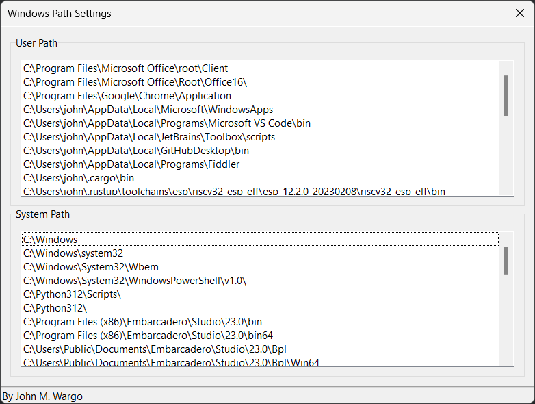

# Windows Path Viewer Delphi

I created this project because I was trying to figure out how to read and update the Windows User and System and paths in a Delphi application running on Windows 11.

In the old Windows days (at least Windows 95, perhaps earlier, I don't remember for certain), Windows maintained the `Path` environment variable in the system's `autoexec.bat` file in the root of the Windows boot drive. Developers and users could edit the file and manipulate the path. All that was required was a reboot and the changes took effect.

I don't know when this happened, but Windows no longer has an `autoexec.bat` file accessible to users, or at least Windows no longer uses the file to configure the path. Instead, the system Path consists of two parts, the User and System paths. Windows stores the path entries in the Registry (`HKEY_CURRENT_USER\Environment` for the User Path and `HKEY_LOCAL_MACHINE\SYSTEM\CurrentControlSet\Control\Session Manager\Environment` for the System Path). 

This repository contains a complete application that loads both the User and System Paths into list boxes so you can view them. Here's what it looks like when you build and run it:

***

You can find information on many different topics on my [personal blog](http://www.johnwargo.com). Learn about all of my publications at [John Wargo Books](http://www.johnwargobooks.com).

If you find this code useful and feel like thanking me for providing it, please consider <a *href*="https://www.buymeacoffee.com/johnwargo" *target*="_blank">Buying Me a Coffee</a>, or making a purchase from [my Amazon Wish List](https://amzn.com/w/1WI6AAUKPT5P9).
